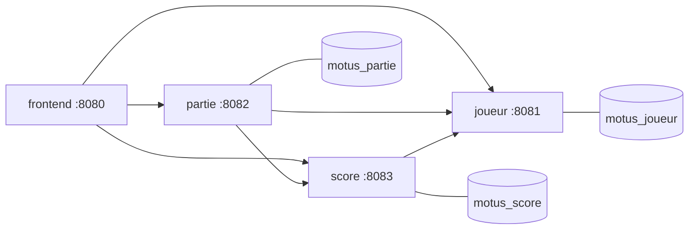

# Motus — application microservices

Jeu du Motus en microservices Spring Boot (Java 25), chacun avec sa base PostgreSQL, communication en REST, et une IHM web.

## Lancer avec Docker

Prérequis : Docker et Docker Compose.

```bash
docker compose up --build
```

Le premier lancement compile les services et télécharge les images : comptez quelques minutes. Ensuite, ouvrez :

```
http://localhost:8080
```

Arrêter (les données sont conservées) :

```bash
docker compose down
```

Repartir de zéro (efface aussi les bases) :

```bash
docker compose down -v
```

## Déployer sur Minikube

Prérequis : Minikube et kubectl.

En une seule commande (démarrage du cluster, build des images, déploiement et tunnels) :

```bash
bash deploy-minikube.sh
```

Puis ouvrir http://localhost:8080.

Le détail des étapes équivalentes, pour un lancement  à la main :

```bash
# 1. Démarrer le cluster (prévoir assez de RAM pour 5 conteneurs)
minikube start --driver=docker --memory=4096 --cpus=4

# 2. Construire les images DANS le démon de Minikube (depuis la racine du projet)
eval $(minikube docker-env)
docker build -f joueur-service/Dockerfile   -t motus/joueur-service:1.0 .
docker build -f score-service/Dockerfile    -t motus/score-service:1.0 .
docker build -f partie-service/Dockerfile   -t motus/partie-service:1.0 .
docker build -f frontend-service/Dockerfile -t motus/frontend-service:1.0 .

# 3. Déployer tous les objets
kubectl apply -f k8s/

# 4. Suivre le démarrage (Ctrl+C quand tout est Running / READY 1/1)
kubectl get pods -w

# 5. Ouvrir les tunnels vers le navigateur
bash k8s/port-forward.sh

# 6. Ouvrir http://localhost:8080
```

Commandes utiles : `kubectl get pods` (état), `kubectl logs deploy/joueur-service` (logs d'un service), `kubectl delete -f k8s/` (tout supprimer), `pkill -f "kubectl port-forward"` (fermer les tunnels).

## Lancer sans Docker (secours)

Prérequis : JDK 25, PostgreSQL, Maven inutile (wrapper `./mvnw` fourni).

Créer les bases une fois :

```bash
sudo -u postgres psql <<'SQL'
CREATE USER motus WITH PASSWORD 'motus';
CREATE DATABASE motus_joueur OWNER motus;
CREATE DATABASE motus_partie OWNER motus;
CREATE DATABASE motus_score  OWNER motus;
SQL
```

Lancer chaque service (un terminal chacun, dans cet ordre) :

```bash
./mvnw -pl joueur-service spring-boot:run     # 8081
./mvnw -pl score-service spring-boot:run      # 8083
./mvnw -pl partie-service spring-boot:run     # 8082
./mvnw -pl frontend-service spring-boot:run   # 8080
```

Puis http://localhost:8080. Depuis IntelliJ : ouvrir le dossier et lancer les quatre classes `*Application`.

## Architecture

Quatre services indépendants, une base PostgreSQL par service, appels REST entre services.



| Service | Port | Rôle | Base |
|---|---|---|---|
| joueur-service | 8081 | Comptes, connexion, rôle admin | motus_joueur |
| partie-service | 8082 | Jeu : dictionnaire, essais, règles | motus_partie |
| score-service | 8083 | Résultats, points, classement | motus_score |
| frontend-service | 8080 | IHM web | — |

## Comptes et administration

Inscription avec pseudo, email et mot de passe (haché en BCrypt). Le code `MIAGE-SITN` saisi à l'inscription donne le rôle admin. L'admin accède à un écran de recherche des parties par date, joueur et statut.

## APIs REST

joueur-service
- `POST /joueurs/inscription` — `{pseudo, email, motDePasse, codeAdmin}`
- `POST /joueurs/connexion` — `{identifiant, motDePasse}`
- `GET /joueurs/{id}` · `GET /joueurs`

partie-service
- `POST /parties` — `{joueurId, longueur}` (4 à 9 lettres)
- `POST /parties/{id}/essais` — `{mot}`
- `GET /parties/{id}` · `GET /parties?joueurId=&statut=&du=&au=`

score-service
- `POST /resultats` · `GET /resultats?joueurId=&du=&au=`
- `GET /classement`

## Dictionnaire

Basé sur Lexique.org : `dictionnaire.txt` (~69 000 mots) pour valider les propositions, `mots-mysteres.txt` (~6 300 noms et adjectifs courants) pour tirer le mot mystère.
